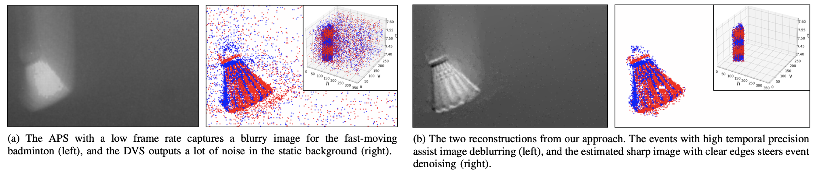

# Overview
This repo provides the code of [Neuromorphic Imaging with Joint Image Deblurring and Event Denoising](https://doi.org/10.1109/TIP.2024.3374074).
```
@article{zhang2024joint,
  title    =  {Neuromorphic Imaging with Joint Image Deblurring and Event Denoising},
  author   =  {Pei Zhang and Haosen Liu and Zhou Ge and Chutian Wang and Edmund Y. Lam},
  journal  =  {IEEE Transactions on Image Processing},
  volume   =  {33},
  pages    =  {2318--2333},
  month    =  {March},
  year     =  {2024},
  doi      =  {10.1109/TIP.2024.3374074},
}
```


Find more Neuromorphic Imaging achievements from our group: [HKU Imaging Systems Laboratory](https://www.eee.hku.hk/~elam/research/pub-uf.html).
## Implementation
Before you start, please glance at the (good and failed) sample files we upload in the folders `data` and `results`.
### Preparation
1. Put your image file and its corresponding event data in the folder you specify by `configs.data` in `demo.m` (default: `data`).
2. The event data must be in `.mat` and contain `t, x, y, p` entries.

### Run
Run `demo.m` with the following configurations:
```
configs.dir:              your dir name
configs.data:             folder that stores input data
configs.results:          folder that stores output results
configs.blur:             input image file
configs.evs:              input event file
configs.dvs_resolution:   DVS spatial resolution
configs.alpha:            weight of the event regularizer
configs.beta:             weight of the l_0 regularizer
configs.sigma:            weight of the Gaussian regularizer
configs.weight:           weight of gradient supervision
configs.N:                find neighbors (1) or not (0)
configs.dx:               spatial threshold to specify a square boundary of the neighbors
configs.dt:               temporal threshold to specify a boundary of the neighbors
configs.case:             specify a use case (-1, 1, 2)
```
For convenience, we split our algorithm into 3 functions, which are controlled by `configs.case`:
1. `configs.case = -1` for experiencing joint image deblurring and event denoising.
2. `configs.case = 1` for image deblurring only (if you have a blurry image and clean events). The following configurations are disabled (any value): `configs.weight`, `configs.N`, `configs.dx`, `configs.dt`.
3. `configs.case = 2` for event denoising only (if you have a sharp image and noisy events). The following configurations are disabled (any value): `configs.alpha`, `configs.beta`, `configs.sigma`.

### Results
Once done, up to 4 files are generated in the folder you specify by `configs.results` in `demo.m` (default: `results`):
1. `xxx_configs.mat`:      record the configurations used
2. `xxx_sharp.png`:        restored sharp image (only for `configs.case = -1` and `configs.case = 1`)
3. `xxx_kernel.png`:       estimated blur kernel (only for `configs.case = -1` and `configs.case = 1`)
4. `xxx_signals.mat`:      denoised events (only for `configs.case = -1` and `configs.case = 2`)

## Dataset

Our real dataset has multiple pairs of blurry images and noisy event streams recorded by a DAVIS346 camera on a rich range of scenarios. Download it from [here](https://connecthkuhk-my.sharepoint.com/:u:/g/personal/u3008016_connect_hku_hk/ESJ-VEuUiu5MjInYNLTDGKUBXPnjPSJLDDe1Chn96Hw2Wg) with password `zhang2024joint`.
